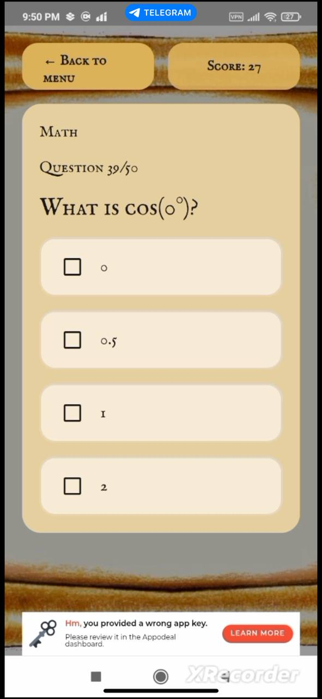
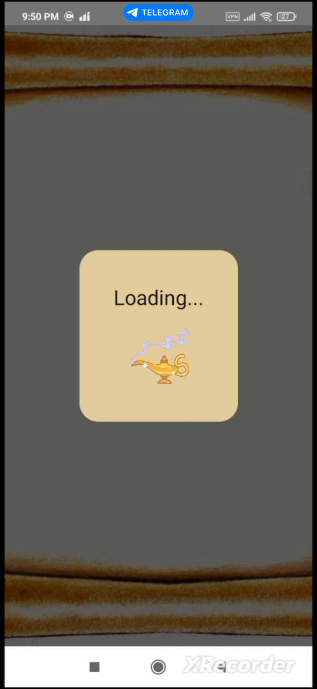
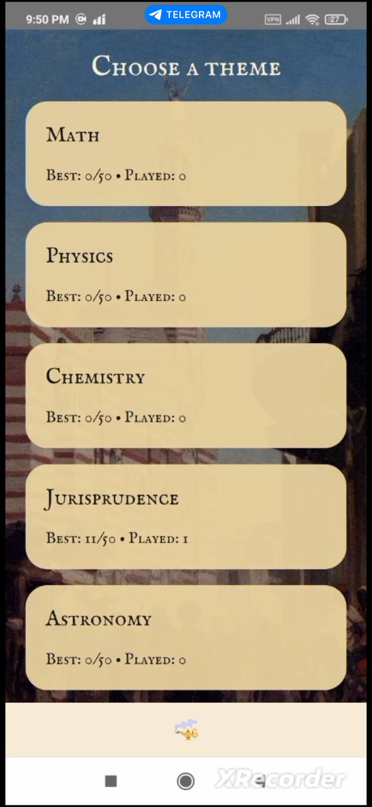
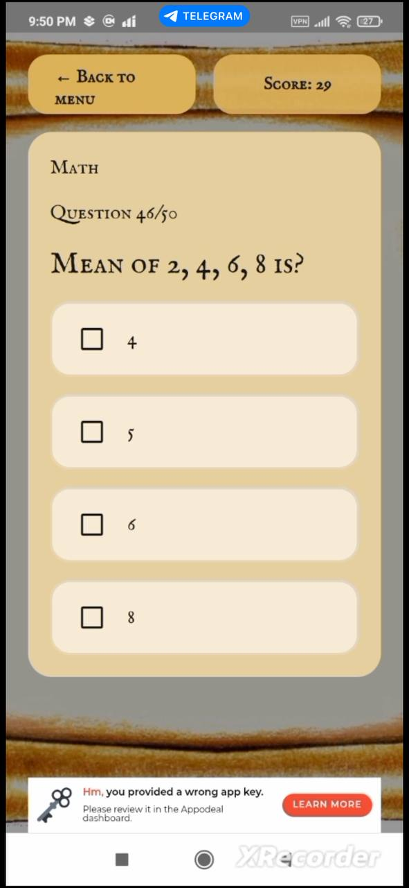
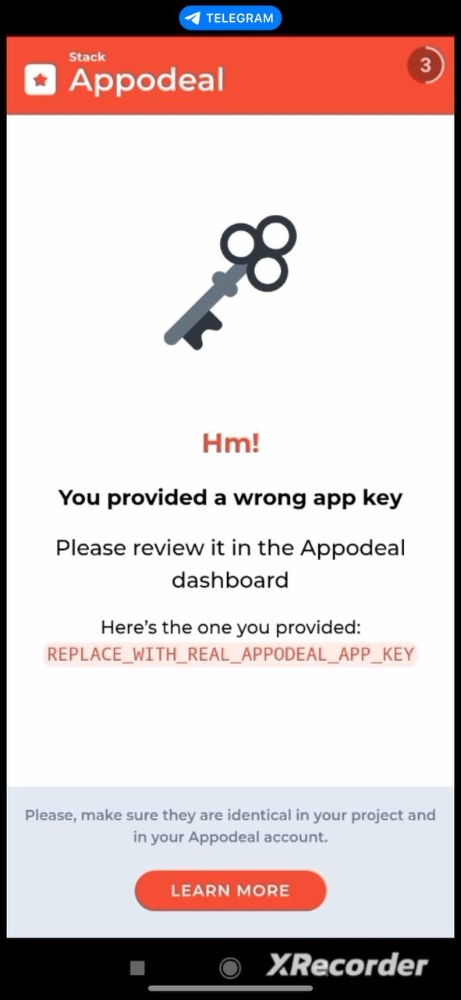
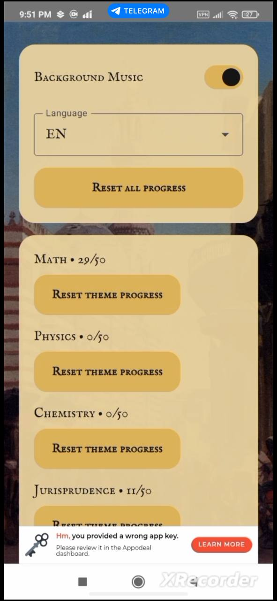
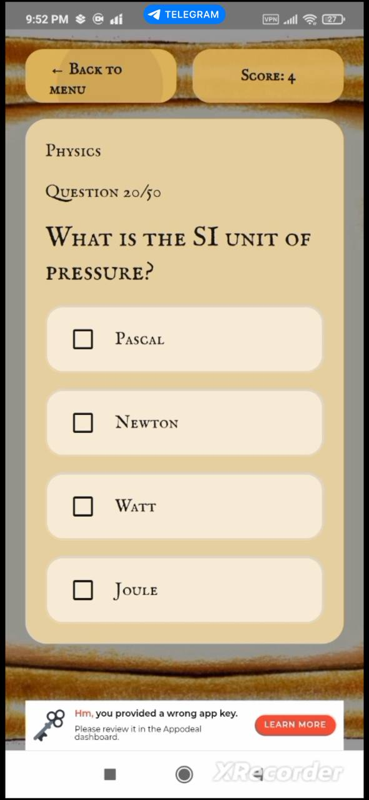
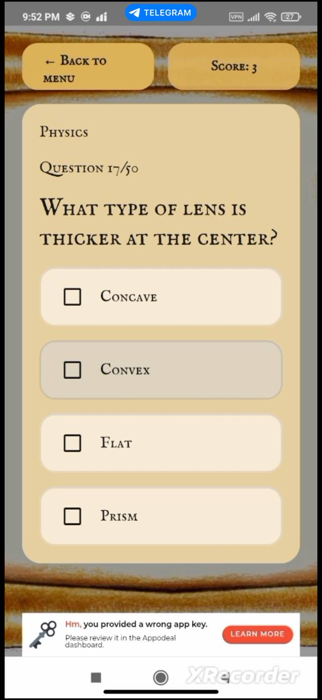
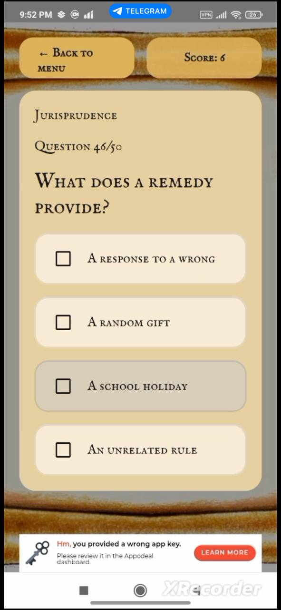

# Al Horezmi School

Kotlin Multiplatform educational quiz app with Arabic/English/Russian localization, progress tracking, records, and Appodeal ad integration (banner + rewarded).

## Screenshots

<table>
	<tr>
		<td></td>
		<td></td>
		<td></td>
		<td></td>
	</tr>
	<tr>
		<td></td>
		<td></td>
		<td></td>
		<td></td>
	</tr>
	<tr>
		<td></td>
		<td></td>
		<td></td>
		<td></td>
	</tr>
</table>

## Manual Tests videos

https://drive.google.com/drive/folders/15loTwsDRNxX8MZ2FHIDEw_x5n3dBJjIi?usp=sharing

## Functionality

- Player name onboarding screen.
- Main menu with theme selection.
- Theme-based quizzes with score tracking.
- In-quiz progress and resume support (saved session per theme).
- Results screen with quotes.
- Records screen (history of played results).
- Settings:
  - Language switching.
  - Music on/off.
  - Reset per-theme progress.
  - Reset all progress.
- Appodeal ads:
  - Banner ad in main menu.
  - Rewarded ad gate before entering level.
  - 3-second rewarded loading timeout: if ad is not ready, level opens automatically.
  - GIF loader (`loader.gif`) used for ad loading states.

## Project Architecture

The codebase follows a layered, feature-driven KMP Clean Architecture structure.

### 1. Presentation Layer

Location: `composeApp/src/commonMain/kotlin/com/alhorezmi/school/presentation`

Contains:
- `screen/`: Compose screens (`MenuScreen`, `LevelScreen`, `SettingsScreen`, etc.).
- `components/`: Shared UI components (cards, buttons, `AppodealBannerAd`, `AppodealRewardedAdDialog`, `LoaderAnimation`).
- `viewmodel/`: State and UI logic (`MainViewModel`, `LevelViewModel`, `SettingsViewModel`, `RecordsViewModel`).
- `localization/`: `AppStrings` and localization helpers.

### 2. Domain Layer

Location: `composeApp/src/commonMain/kotlin/com/alhorezmi/school/domain`

Contains:
- `model/`: Core models (`QuizSection`, `QuizResult`, `ThemeProgress`, `AppSettings`, etc.).
- `repository/`: Repository contracts.
- `usecase/`: Business use cases used by view models.

### 3. Data Layer

Location: `composeApp/src/commonMain/kotlin/com/alhorezmi/school/data`

Contains:
- `repository/`: Repository implementations for quiz data, settings, and records.
- `storage/`: Local/platform services (e.g., music service interfaces).
- `network/`: Appodeal ad manager interface + expect/actual implementations.

### 4. Dependency Injection

Location: `composeApp/src/commonMain/kotlin/com/alhorezmi/school/di/AppModule.kt`

- Koin is used for dependency graph wiring.
- Use cases, repositories, view models, music service, and ad manager are registered here.

## Configuration Checklist (Important)

Before production testing:

1. Set real Appodeal key in `gradle.properties`:
   - `APPODEAL_APP_KEY=YOUR_REAL_KEY`
2. Replace test Google Mobile Ads App ID in Android manifest with your real one.
3. Keep internet/network permissions in manifest.

## Notes

- iOS Appodeal implementation is currently stubbed; Android has active integration.
- If ads fail to load, app flow remains non-blocking and continues to gameplay.
